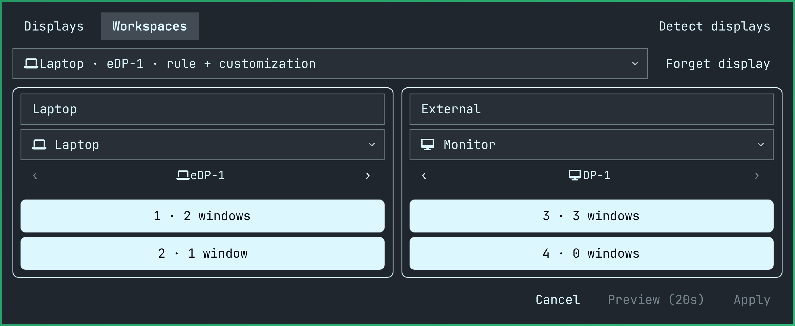
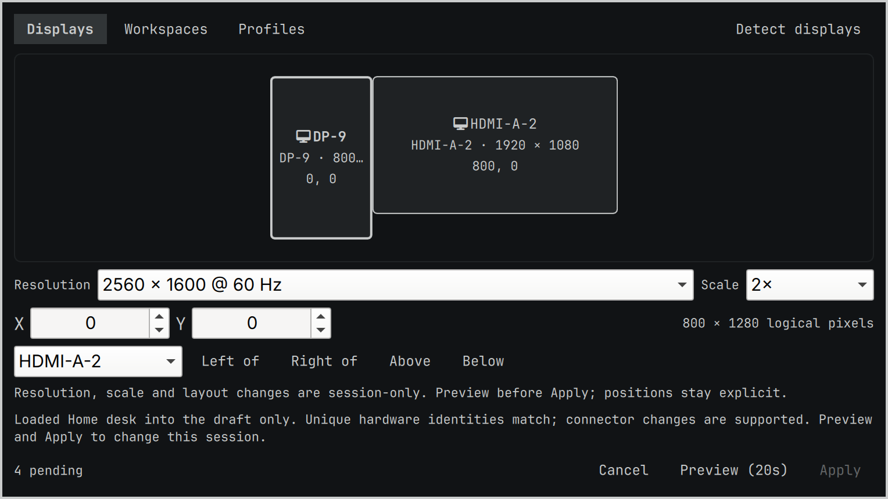
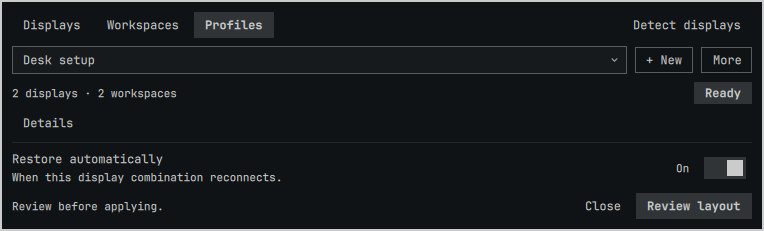
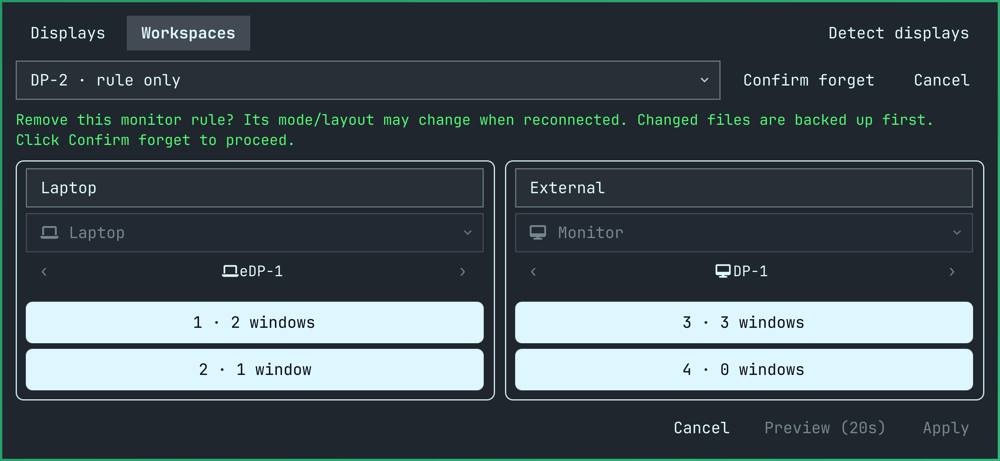

# Omarchy Display Workspaces

**See which workspaces belong to which display. Arrange them without a configuration detour.** A compact, no-frills widget and panel for the Omarchy Quickshell bar.

**Plugin ID:** `display.workspaces` · **Version:** 2.4.0

> **Caution — AI-generated by GPT Astra.** This plugin's custom implementation and documentation were developed with AI under human direction, building on Omarchy code. Treat it as experimental: review the code, back up your configuration, and use it at your own risk. It runs unsandboxed as your user and can change live displays and configuration files. Tests, confirmation dialogs, and rollback reduce risk; they do not guarantee recovery or replace an independent review.

## See it in action

Real plugin UI with **synthetic example displays/workspaces**, captured on an opaque, neutral background—not a personal desktop. The installed widget and panel use your Omarchy theme and translucency.

### Your displays and workspaces, together in the menubar


Each display gets its own **name, icon, and group of workspaces**. Right-click a display label to open the panel, where you can:

- **Name each display** and choose a curated Nerd Font icon.
- **Assign existing workspaces to displays** by moving workspace cards between columns, then Preview and Apply.
- **Order the display groups however you like** using the left/right controls. Each display and its workspace group move together in the panel and menubar; this changes presentation order, not physical screen positions.

Names, icons, and display-group order save immediately. Workspace moves require confirmation and remain session-only.

The indicators distinguish cursor location from keyboard focus: here, **Desk** is green because the cursor is on that display, while **Laptop workspace 1** is green and underlined because it has keyboard focus. Brackets mark visible workspaces; dim numbers mark empty, non-visible workspaces.

### Customize display groups and move workspaces



The **Workspaces** tab puts naming, icons, group order, and workspace assignment in one view. Name/icon changes update in place without recreating controls or losing draft workspace moves and unfinished name edits in other columns.

### Arrange your screens with a safety countdown



Choose an advertised resolution/refresh rate and valid scale, then drag displays on the map or use coordinates and left/right/above/below controls. **Preview (20s)** tries the complete draft live; **Apply** keeps it for this session, while Revert or expiry restores the previous arrangement where recovery remains possible.

### Recall a familiar setup, manually or on reconnect



**New → Save profile** remembers the live display geometry and workspace placement—not untested draft edits. Select a profile and **Review layout** to prepare a draft, then Preview and Apply. **Details** expands compatibility information; hardware-first matching supports connector changes. **More** contains confirmed Update from current and Delete actions, both with backups.

Profile previews restore missing saved workspaces and keep the saved set available even when empty. Extra empty workspaces are removed; extra workspaces with windows stay untouched. Creation and cleanup are shown in the draft and covered by the same rollback countdown.

Optionally turn on **Restore automatically** for a saved arrangement that is already live, then confirm the warning. One explicitly enabled profile can restore for each complete, strongly identified display combination after connections settle, or on a new compositor session's initial check. **No future Apply click:** the independent worker verifies for 20 seconds, then keeps the session arrangement. Open the panel to **Revert** during that countdown. It does not open the panel or steal focus. Weak identities remain manual-only; updating a profile disables its automation.

### Clean up old display configuration deliberately



**Forget display** lists supported monitor rules and saved customization, including unnamed or disconnected displays. It requires a second confirmation and backs up changed files. **Removing an active rule can change its live mode or layout**; this is configuration cleanup, not merely hiding a display.

## Why this approach

A flat workspace list hides which screen owns what; simple layout changes should not require a full settings application or hand-editing coordinates. This plugin combines a per-display overview with three compact native tabs, explicit profiles with optional reconnect restoration, and deliberate confirmation.

- **Separate presentation from live changes:** names/icons/order save immediately; layout and workspace moves use a session-only preview. Saving a profile is a separate action.
- **Refuse unsafe guesses:** ambiguous identities, unsupported rules, stale state, or invalid geometry block the affected operation with a reason.
- **Keep recovery independent:** the rollback worker survives the panel, but recovery still depends on usable displays and compositor state.

No extra Python packages, persistent background service, automatic layout learning, individual-window placement tracking, rotation editor, or HDR control panel.

## Install from GitHub

Install through Omarchy's plugin-add prompt using this repository's URL, or run:

```bash
omarchy plugin add https://github.com/nephilus/omarchy-display-workspaces.git --enable
```

Review the trust warning and choose a bar section when prompted. To explicitly place it on the left:

```bash
omarchy plugin enable display.workspaces --section left
```

If you want it to replace the stock workspace widget, disable the stock widget after confirming the new one works:

```bash
omarchy plugin disable omarchy.workspaces
```

This requires the **Omarchy Quickshell plugin system and Hyprland's Lua API**. It is not a standalone Quickshell configuration, Waybar module, or plugin for older `hyprland.conf`-only setups. Tested on Omarchy **4.0.3-1**, Hyprland **0.56.2**, and Quickshell **0.3.1**; compatibility with other releases is not guaranteed.

See [installation and updates](docs/INSTALLATION.md) for requirements, noninteractive installation, removal, and existing local clones.

**Upgrading from 1.x?** Version 2.0 changes the plugin ID. Follow the [settings-preserving migration](docs/INSTALLATION.md#upgrading-from-1x) instead of installing a second widget.

## Safety and limits

- **Apply is session-only:** it does not write layout or workspace bindings into `monitors.lua`. Configuration reloads or a new session can reapply existing rules.
- **Profiles are explicit, separate storage:** they retain geometry—including rotation—and positive workspace placements, not names/icons/bar order. Missing or changed displays, ambiguous matches, unavailable modes, and unsafe geometry block loading. Restoration retains saved workspace IDs, removes empty extras, and preserves populated extras; runtime workspace rules remain session-only. Automatic restoration is off by default and requires a separate opt-in.
- **Live display changes require supported exact connector rules**, including after connector renaming. Dynamic, broad, conditional, or ambiguous rules cannot be removed automatically.
- **Recovery is best-effort:** failed Forget reloads attempt guarded restoration, and preview rollback preserves unrelated external geometry. Hardware changes or concurrent edits can require manual recovery; backups are not permission to overwrite newer changes blindly.
- **Automation is not continual enforcement:** open panels or manual operations skip the current connection episode. Configuration reload alone does not trigger a restore. Failed or skipped attempts do not loop; another genuine connection event is needed. Compositor checks cannot prove a screen is visible—only enable a known-good profile.

Read [usage, safety, and recovery](docs/USAGE.md), including the [profile workflow and limits](docs/USAGE.md#manual-profiles), before changing layouts or monitor rules.

## Development

Coding agents must read [AGENTS.md](AGENTS.md) first. Documentation and screenshot work also follows [docs/AGENTS.md](docs/AGENTS.md).

```bash
git clone https://github.com/nephilus/omarchy-display-workspaces.git
cd omarchy-display-workspaces
omarchy plugin validate .
python3 -m unittest test_apply test_configuration test_profiles
```

There is no build step or Python package installation. The Python backend uses the standard library. Backend regression tests use synthetic data and temporary files; they do not rearrange your real displays.

- `Workspaces.qml`: bar widget, saved presentation settings, and elected cursor/focus observation.
- `HyprlandEventStream.qml`: reconnecting native event subscription for workspace-focus recovery.
- `ArrangePanel.qml`, `ArrangePopup.qml`, `DisplayMap.qml`: native arrangement UI.
- `apply.py`: discovery, validation, session preview/rollback, and detached workers.
- `configuration.py`: nonexecuting Lua rule discovery, merged catalog, guarded configuration edits and recovery.
- `profiles.py`: guarded named snapshots, hardware matching, draft-only manual loading, and explicit automation consent.
- `automation.py`: settled connection episodes, strong profile selection, and unattended authorization guards.

## License and credits

[MIT](LICENSE). Derived from [Omarchy](https://github.com/basecamp/omarchy), including its workspace widget and keyboard-panel implementation. The upstream copyright notice is retained. This is a third-party plugin, not an official Omarchy release; its neutral `display.workspaces` ID keeps it outside the first-party `omarchy.*` namespace.
